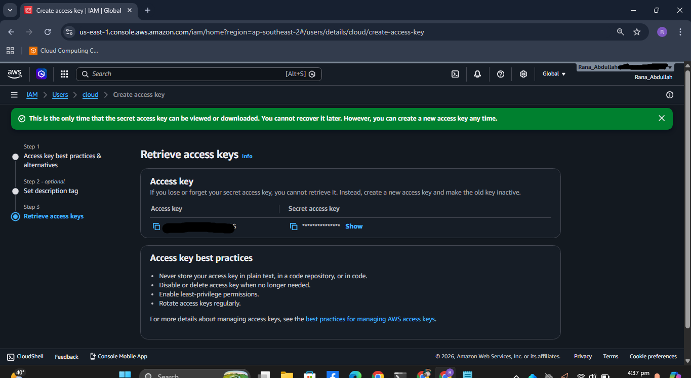
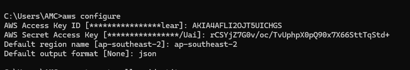
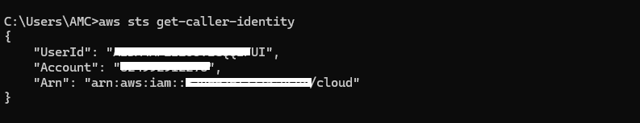
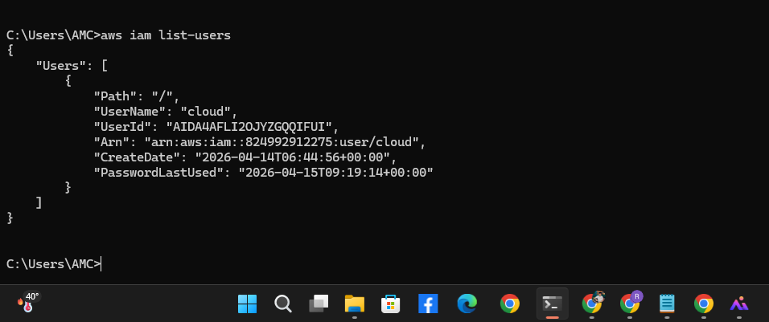

# AWS CLI Setup and IAM Management

This repository demonstrates the professional configuration of the AWS Command Line Interface (CLI) and the management of Identity and Access Management (IAM) users. It showcases the ability to bridge local development environments with cloud infrastructure securely.

## 🚀 Project Overview
The objective of this project is to establish a secure connection between a local machine and AWS Cloud services, verify user identities via CLI, and manage programmatic access keys.

## 📁 Repository Structure
* **Configuration**: AWS CLI setup and regional preferences.
* **IAM Management**: Identity verification and user auditing.
* **Documentation**: Visual step-by-step implementation.

## 📸 Practical Implementation

### 1. Programmatic Access Setup
The process of generating new Access Keys through the AWS Management Console to enable secure API and CLI interactions.

### 2. AWS CLI Configuration
Configured the AWS environment using the `aws configure` command. This step involves setting the Access Key ID, Secret Access Key, and the default region to `ap-southeast-2`.

### 3. Identity Verification
Used the `aws sts get-caller-identity` command to verify that the CLI is correctly authenticated with the intended IAM user (`cloud`).

### 4. IAM User Audit
Listing existing IAM users within the AWS account using the `aws iam list-users` command to ensure proper resource management.

## 🛠 Tech Stack
* **Cloud Provider**: Amazon Web Services (AWS)
* **Tools**: AWS CLI (v2), AWS IAM
* **Interface**: Windows Command Prompt (CMD)

## ⚖️ License
This project is licensed under the [MIT License](LICENSE).

---
> **⚠️ Security Warning:** All Access Keys and sensitive data shown in this demonstration have been rotated and deactivated. Never expose your live AWS credentials in public repositories.
